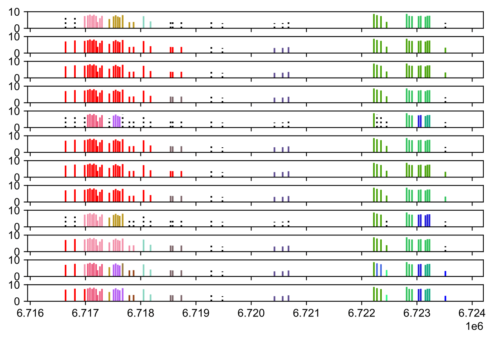
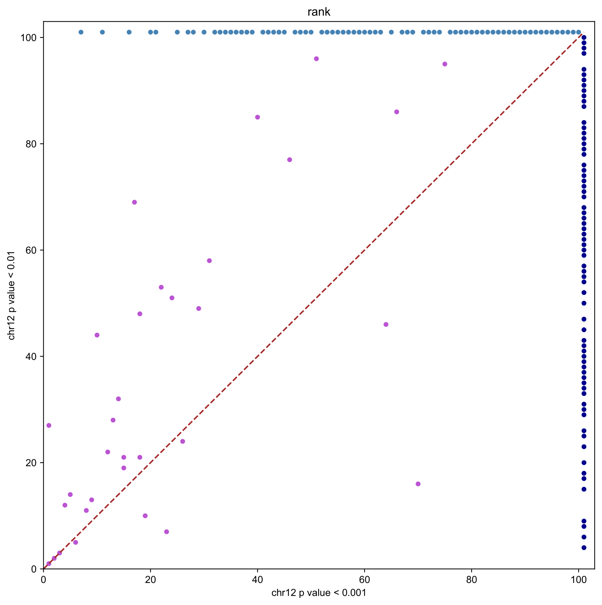
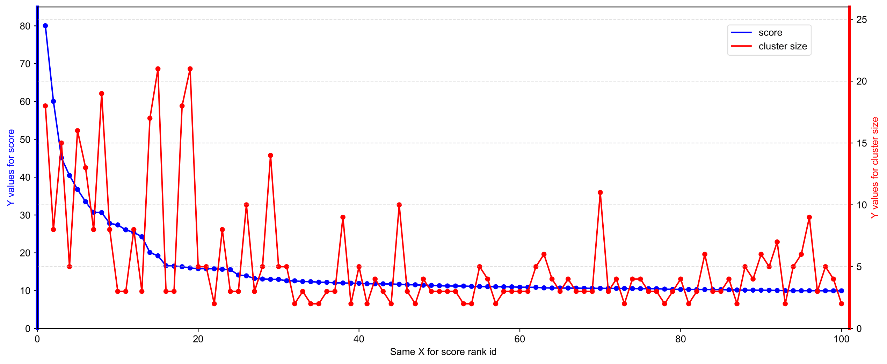
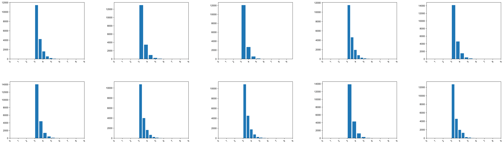
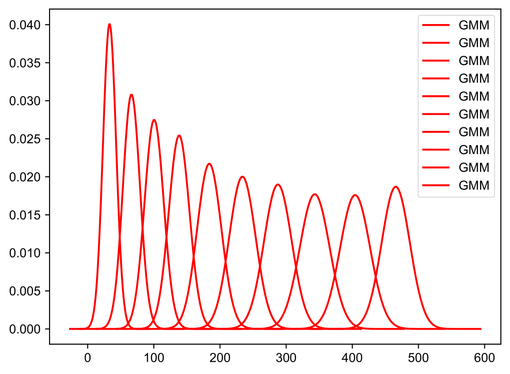
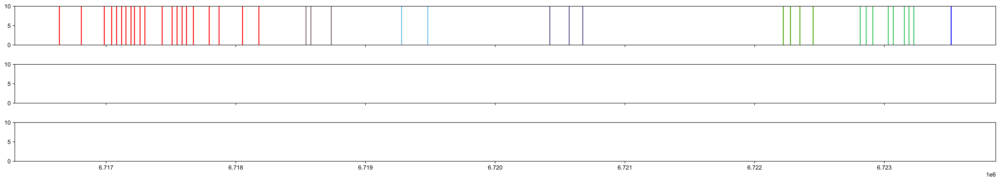
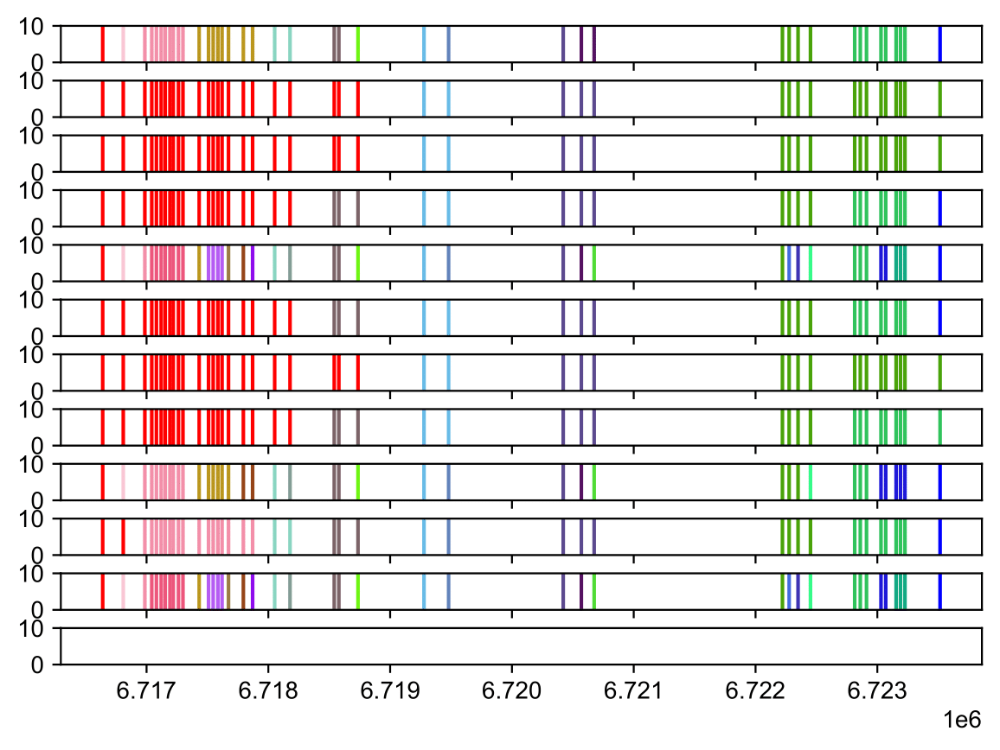
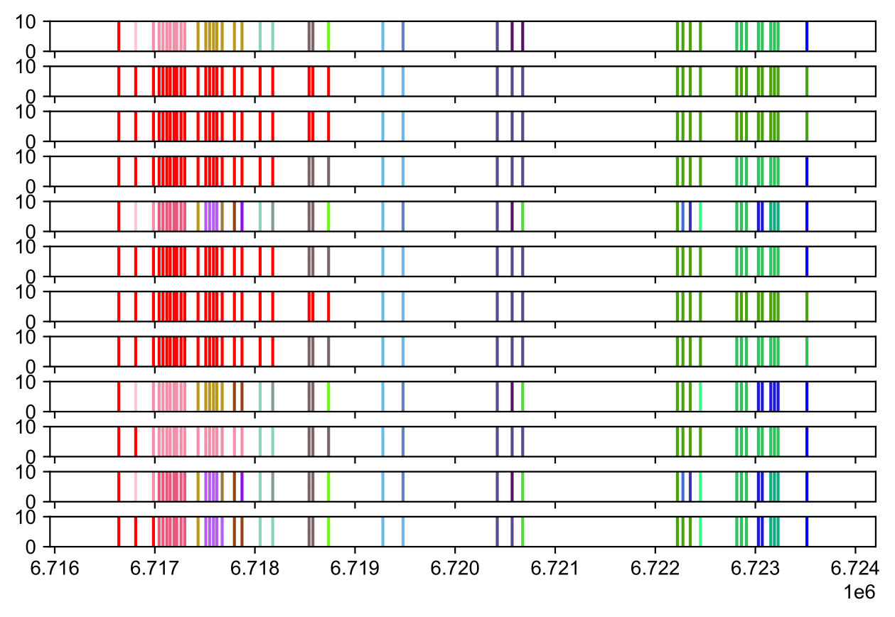
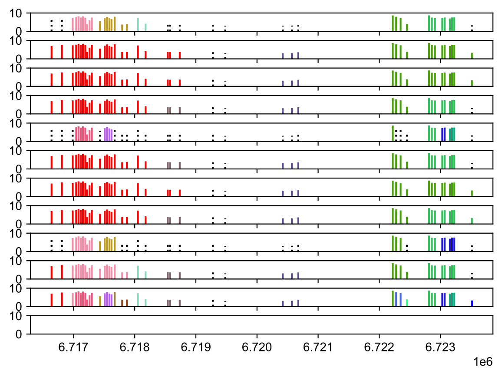

# MotifCluster
# Tutorial
# Installation instructions
## 1. Installation:
#### (Note: need to install in Linux environment)
#### Download code and create a new conda environment

    git clone https://github.com/yao-laboratory/MotifCluster.git 
    cd MotifCluster
    conda create -n motifcluster

#### Check channels:
(command: conda config --show channels)
#### If not have either of them:
(defaults/bioconda/conda-forge), please use the following instructions to add channels.

    conda activate motifcluster
    conda config --add channels defaults 
    conda config --add channels bioconda 
    conda config --add channels conda-forge

#### Install packages 
(located: installation_packages)

    conda install python="3.9.10"
    pip install -r installation_packages/requirements_pip.txt
    conda install --file installation_packages/requirements_conda.txt
## 2. Command Overview:
Make sure to activate the environment first(e.g.conda activate motifcluster), then directly type:
```
python3 MotifCluster/MotifCluster.py --h
```
Then you can get all the sub commamd shown as below,which means you installed the package succesfully, or else you need to check the installation.
```
usage: MotifCluster [-h] {cluster_and_merge_simple_dbscan,cluster_and_merge,pre_process,calculate_score,draw,draw_GMM,draw_cluster_weight,draw_rank,draw_score_size} ...

positional arguments:
  {cluster_and_merge_simple_dbscan,cluster_and_merge,pre_process,calculate_score,draw,draw_GMM,draw_cluster_weight,draw_rank,draw_score_size}
                        Sub Commands Help
    cluster_and_merge_simple_dbscan
                        Using direct DBSCAN method to identify local motif clusters
    cluster_and_merge   Identify local motif clusters
    pre_process         Convert fimo.tsv file into the sorted bed file
    calculate_score     conduct scores and give ranks for all clusters
    draw                Draw a region of interest and it shows the distinctively colored clusters view.
    draw_GMM            Draw all Gaussian components' GMM distributions.
    draw_cluster_weight
                        drawing the distribution of peaks' weights in every Gausssion component
    draw_rank           Draw the performance(ranks) of top 100 clusters in without-noise data alongside their corresponding ranks in the noise data
    draw_score_size     Draw the corresponding cluster score and cluster size for the top 100 clusters in specific genome.

optional arguments:
  -h, --help            show this help message and exit
```

# Preprocessing functions
### Description:
This pre_process command can convert fimo.tsv file into the sorted bed file which is an essential input for main commands.
### Overview:  

     usage: python3 MotifCluster/MotifCluster.py pre_process -input_name -output_name -chrome
    
     required arguments: 
     -input_name FILENAME,   FILENAME: your input file name, the file should be put into the input_files folder.    
                                      (located: Motif_Cluster/input_files)    
     -output_name FILENAME,  FILENAME: your customized output file name, the file automatically 
                                       put into the input_files folder.
     -chrome CHROME,         CHROME:   chrome name in the bed file, eg.chr16

### Input:
Input file: e.g.:fimo.tsv, Input parameter: 1.chrome name. 2.You can define which folder you want to put the output results in.
eg. chr16 's fimo.tsv file:

    motif		NC_000016.9	122369	122379	+	12.8	1.53e-07	0.0699	GGCCCCGGCCC
    motif		NC_000016.9	122375	122385	+	12.8	1.53e-07	0.0699	GGCCCCGGCCC
    motif		NC_000016.9	188276	188286	-	12.8	1.53e-07	0.0699	GGCCCCGGCCCT

### Command example:
    python3 MotifCluster/MotifCluster.py pre_process -input_name fimo_chr16.tsv -output_name sorted_chr16.bed -chrome chr16
### Output: 
It can produce sorted bed file, stored directly in the input_files folder. eg. sorted_chr16.bed:   

    chr16	61384	61394	GGCCCCAGCCC		-		P-value=1.83e-06
    chr16	62064	62074	GGCTTTGGCCC		+		P-value=1.77e-05
    chr16	62660	62670	GGCCTGGGCTC		-		P-value=1e-05

# MotifCluster Method
#### (Note: step2 and draw function need step1's output, so rename step1's output folder when needed in case covering step1's output results)
## Step1: cluster and merge
### Description:
This cluster and merge command utilized our MotifCluster Method to identify local motif clusters.
### Overview:

     usage: python3 MotifCluster/MotifCluster.py cluster_and_merge
                    -input -merge_switch -weight_switch -output_folder [-start -end]
    
     required arguments: 
     -input        FILENAME,  FILENAME: your input file name(Note: sorted bed file),
                                        the file should be put into the input_files folder.
                                        (located: Motif_Cluster/input_files)   
     -merge_switch STATUS,    STATUS: on or off,
                                      on: run the program including merge step,
                                      off: run the program without including merge step    
     -weight_switch STATUS,   STATUS: on or off,
                                      on: run the program including weight information,
                                      off: run the program without weight information    
     -output_folder FOLDER,   FOLDER: your customized output folder name
    
     optional arguments:
     -start NUM               NUM: the start coordinate of processing this input bed file 
     -end   NUM               NUM: the end coordinate of processing this input bed file

### Input:
Input file: The bed file (sorted bed file, if fimo.tsv, can use above "Preprocessing functions" to change.)    
Input parameters:     '-merge_switch', '-weight_switch' ,'-output_folder' (explained in overview). You can define which folder you want to put the output results in.
#### Note: You should put any sorted bed files you want to test in this input_files folder when using this command. 

human_chr12_origin.bed default in input_files folder shown as below:     

    chr12	60025	60042	TCCATTCCCTAGAAGGC	-1421	+	MA0752.1	P-value=5.29e-04  
    chr12	60063	60080	TCCATTCCCTAGAAGGC	-1421	+	MA0752.1	P-value=5.29e-04  
    ...
### Command example:

    python3 MotifCluster/MotifCluster.py cluster_and_merge -input human_chr12_origin.bed -merge_switch on  -weight_switch on -output_folder example_output_step1_1
    python3 MotifCluster/MotifCluster.py cluster_and_merge -input human_chr12_origin.bed -merge_switch on  -weight_switch on -output_folder example_output_step1_2 -start 6716000 -end 6724000 
    
Use either of the commands one time	
Difference between two commands: command the -start -end can only process part of the chr12.bed files.
### Output:       
Store the output files in the folder you specified by -output_folder parameter, In this example is 'example_output_step1_1' folder (located:example_output_step1_1).       
    
#### 1.Middle processing files:

Users don't need to use.(located: example_output_step1_1/tmp_output)
#### (Note: do not change cause it is the middle processing result, useful in step 2 (score and rank) and drawing, it will update by itself.)
Including files: n+1+3 middle files. n is class number.

     1,2,...,n.bdg, total.bdg,
     GMM_covariances.npy,GMM_means.npy,GMM_weights.npy
    
#### 2.User final files:

located: example_output_step1_1/result.csv example_output_step1_1/result_middle.csv,example_output_step1_1/result_draw.csv

#### 2.1 result.csv    (NOTE: In the paper, called cluster-union.csv instead)
#### example description:
In the result.csv file:  
Each line is the nth line(peak) from the original bed file's information: Each line contains 'center_pos' and 'end_pos', which represent the start and end coordinates of the peak, respectively. The 'weight' column indicates the weight of the peak. The column 'class_id', it indicates the group which the peak belongs to. If consecutive peaks share the same 'class_id', such as 4, it signifies that they are part of the same group and, therefore, can be aggregated into a single cluster.

    id,center_pos,start_pos,end_pos,class_id,weight
    
    1,60033,60025,60042,4,3.2765443279648143
    
    2,60071,60063,60080,4,3.2765443279648143
    
    3,60109,60101,60118,4,3.2765443279648143
    ...
 
#### 2.2 result_middle.csv
#### example description:
In the "result_middle.csv" file, each line presents information for the nth cluster, including 'data_count_new' which indicates the number of peaks from the original bed files, and 'cluster_belong_new' which denotes the group that the cluster belongs to. The 'data_count_sum' is used internally within the code.
```
id,data_count_new,cluster_belong_new,data_count_sum

1,3,4,3

2,1,-1,4

3,1,-1,5
...
```

#### 2.3 result_draw.csv
#### example description:
In the result_draw.csv file:  
Each line is one peak in different groups and this peak's color in each subfigure is stored from 'draw_input0' to 'arr_final_draw', as well as includes weight information which can be used to visualize the weight in the figure. Given that the motifcluster method generates 12 subfigures, for each peak, there are 12 corresponding columns ranging from 'draw_input0' to 'arr_final_draw' to represent these 12 subfigures.

    id,center_pos,weight,draw_input0,draw_input1,draw_input2,draw_input3,draw_input4,draw_input5,draw_input6,draw_input7,draw_input8,draw_input9,arr_final,arr_final_draw
    
    0,60033,3.2765443279648143,0,0,0,0,0,0,0,0,0,0,0,0
    
    1,60071,3.2765443279648143,0,0,0,0,0,0,0,0,0,0,0,0
    
    2,60109,3.2765443279648143,0,0,0,0,0,0,0,0,0,0,0,0
    ...
  

## Step2: score and rank
### Description:
This score and rank command is designed to conduct score for each cluster and give them rank based on their final score.
### Overview:

     usage: python3 MotifCluster/MotifCluster.py  calculate_score
                    -input_bed -input_result -input_middle -weight_switch -output_folder 
    
     required arguments: 
     -input_bed     FILENAME,  FILENAME:  your input file name(Note: step 1's sorted bed file)
                                        the file should be put into the input_files folder.
                                        (located: Motif_Cluster/input_files)   
     -input_result  FILENAME,  FILENAME:  your input file name(Note: result*.csv),
                                        the file generated in the output file in step1
                                        (located: example_output_step1_1)
     -input_middle  FILENAME,  FILENAME:  your input file name(Note: result_middle*.csv),
                                        the file generated in the output file in step1
                                        (located: example_output_step1_1)
     -weight_switch STATUS,  STATUS:    on or off,
                                        on: run the program including weight information,
                                        off: run the program without weight information    
     -output_folder FOLDER,  FOLDER:    your customized output folder name


### Input:
Input files: The bed file should use the same one in step 1, and already in the input_files folder. result.csv and result_middle.csv produced by step1 in the step1's output folder.    
Input parameter:'-weight_switch'; You can define which folder you want to put the output results in.
### Command example:
```
python3 MotifCluster/MotifCluster.py  calculate_score -input_bed human_chr12_origin.bed -input_result example_output_step1_1/result.csv -input_middle example_output_step1_1/result_middle.csv -weight_switch on -output_folder example_output_step1_1
```
### Output: 
In this example，output_folder: example_output_step1_1 (located: Motif_Cluster/example_output_step1_1).    
Each output produces two output files:     
result_score.csv,  result_cluster_weight.csv. Notice: result_score.csv is the final file. 
#### 2 output files:
#### result_score.csv (NOTE: In the paper, called cluster-score.csv instead)
#### example description:
In the "result_score.csv" file, each line contains information about the nth highest-scoring cluster. This includes 'start_pos_head_axis' and 'end_pos_head_axis' to denote the start and end coordinates of the cluster, respectively. 'Cluster_size' indicates the number of peaks within the cluster, 'belong_which_class' specifies the group to which the cluster is assigned, 'max_weight' identifies the highest weight of the peaks in the cluster,'average_gap' calculates the average gap of each cluster, and 'score' represents the final score of the cluster.

    rank_id,start_pos,start_pos_head_axis,end_pos,end_pos_tail_axis,cluster_size,belong_which_class,max_weight,average_gap,score
    
    1,96048706,96048698,96049258,96049267,18,4,5.10902,32.470588,80.03299
    
    2,6717043,6717035,6717299,6717308,8,4,8.218245,36.571429,60.059913
    
    3,82498733,82498725,82499113,82499122,15,4,4.416801,27.142857,45.105223
    
#### result_cluster_weight.csv
#### example description:
In the result_cluster_weight.csv file:  
The first line is the number of the peaks in each group. This example has 10 groups, each group's total cluster number labeled from 'cluster_length0' to 'cluster_length9'. Information beyond this within the file is not useful to the user.
Begining with the second line, the 'cluster0' column lists the weights of all peaks in the first group, and this pattern continues up to the 'cluster9' column. Information beyond this within the file is not useful to the user.

    ,cluster0,cluster1,cluster2,cluster3,cluster4,cluster5,cluster6,cluster7,cluster8,cluster9,cluster_length0,cluster_length1,cluster_length2,cluster_length3,cluster_length4,cluster_length5,cluster_length6,cluster_length7,cluster_length8,cluster_length9
    0,3.0,3.0,3.0,3.0,3.0,3.0,3.0,3.0,3.0,3.0,18152,17751,15467,19329,20885,20475,17415,18307,19820,20939
    1,3.0,3.0,3.0,3.0,3.0,3.0,3.0,3.0,3.0,3.0,-1,-1,-1,-1,-1,-1,-1,-1,-1,-1
    2,3.0,3.0,3.0,3.0,3.0,3.0,3.0,3.0,3.0,3.0,-1,-1,-1,-1,-1,-1,-1,-1,-1,-1

# Drawing functions
## Function1:
### Description:
This command is designed to generate a pdf picture about a region of interest and it shows the distinctively colored clusters view.
### Overview:

     usage: python3 MotifCluster/MotifCluster.py draw
                    -inputbed -inputcsv -method -output_folder [-start] [-end]
    
     required arguments:
     -inputbed   FILENAME,  FILENAME:  your input file name(Note: step 1's sorted bed file)
                                        the file should be put into the input_files folder.
                                        (located: Motif_Cluster/input_files)   
     -inputcsv   FILENAME,  FILENAME:  your input file name(Note: result_draw*.csv),
                                        the file generated in the output file in step1
                                        (located: example_output_step1_1)
     -method      NUM,        NUM:      The method you use:
                                        NUM = 1: MotifCluster: with peak intensity, with cluster merge (method d)
                                        NUM = 2: direct DBSCAN without groups (method a)
                                        NUM = 3: No peak intensity, no cluster merge (method b1)
                                        NUM = 4: No peak intensity, with cluster merge (method b2)
                                        NUM = 5: with peak intensity, no cluster merge (method c)
     -output_folder FOLDER,  FOLDER:    your customized output folder name

     optional arguments:
     -start NUM               NUM: the start coordinate of drawing this input bed file 
     -end   NUM               NUM: the end coordinate of drawing this input bed file


### Input:
Input files: sorted bed file in step1 still need here, result_draw file generated in the output file in step1
Input parameter:'-method', You can define which folder you want to put the output results in,'-start','-end'
### Command example:
 
python3 MotifCluster/MotifCluster.py draw -inputbed human_chr12_origin.bed -inputcsv example_output_step1_1/result_draw.csv -method 1 -output_folder drawing_f1 -start 6716500 -end 6724000

### Output:  
1 output file: draw_figure.pdf in the output folder you defined (eg.drawing_f1), located: drawing_f1 
#### example description:
* This figure below shows using MotifCluster Method, the area in Human genome chr12:6,716,600-6,724,000 which is the ZNF410 binding clusters on the CHD4 promoter region.The x-axis is the coordinate from `6.717*10^6` to `6.724*10^6` in the chr12, and y-axis is the weight of each peak.12 line's figure. The diagram consists of 12 lines with weight information and illustrates data grouped into 10 Gassian components, one union-split and a single merge.
  
 <br> 

## Function2:
### Description:
This command is designed to generate a pdf picture about the performance(ranks) of top 100 clusters in without-noise data alongside their corresponding ranks in the noise data.
### Overview:

     usage: python3 MotifCluster/MotifCluster.py draw_rank
                    -input1 -input2 -output_folder
    
     required arguments:
     -input1       FILENAME,  FILENAME:  your input file name(result_score.csv without noise)
                                        the file should be put into the input_files folder.
                                        (located: Motif_Cluster/input_files)   
     -input2       FILENAME,  FILENAME:  your input file name(result_score.csv with noise),
                                        the file generated in the output file in step1
                                        (located: example_output_step1_1)
     -output_folder FOLDER,   FOLDER:    your customized output folder name

### Input:
Two result_score files located: Motif_Cluster/input_files, and You can define which folder you want to put the output results in,'-start','-end'
### Command example:
```
python3 MotifCluster/MotifCluster.py draw_rank -input1 result_score_chr12.csv -input2 result_score_chr12_half_noise-0.005.csv -output_folder drawing_f2
python3 MotifCluster/MotifCluster.py draw_rank -input1 result_score_chr12.csv -input2 result_score_chr12_whole_noise-0.01.csv -output_folder drawing_f2
```
### Output:  
1 output file: normal_vs_noise_rank.pdf in the output folder you defined (eg.drawing_f2), located: drawing_f2    
#### example description:
* In this figure, x-axis is the rank in the without noise chr12, y-axis is its' corresponding rank in the noise chr12. And the purple dots means both rank <=100, light blue dots means rank <= 100 in chr12 p-value < 0.001 but its' corresponding rank > 100 in p-value < 0.01, and deep blue dots means rank <= 100 in chr12 p-value < 0.01 but its' corresponding rank > 100 in p-value < 0.001.    
 <br>

## Function3:
### Description:
This command is designed to generate a pdf picture about corresponding cluster score and cluster size for the top 100 clusters in specific genome. 
### Overview:

     usage:  python3 MotifCluster/MotifCluster.py  draw_score_size
                    -input -output_folder
    
     required arguments:
     -input       FILENAME,  FILENAME: your input file name(result_score.csv)
                                        the file generated in the output file in step2
                                        (located: example_output_step1_1)  
     -output_folder FOLDER,   FOLDER:   your customized output folder name

### Input:
1 result_score.csv file located:  example_output_step1_1, and you can define which folder you want to put the output results in
### Command example:
 
   python3 MotifCluster/MotifCluster.py  draw_score_size -input example_output_step1_1/result_score.csv -output_folder drawing_f3
 
### Output:  
1 output file: score_size.pdf in the output folder you defined (eg.drawing_f3), located: drawing_f3 
#### example description:
* In this figure, x-axis is the rank id, left y-axis is their corresponding score, right y-axis is their corresponding cluster size.         
  <br>  

## Function4:
### Description:
This function can visualize: In every Gaussian component which those peaks best fitted separately, it shows the distribution of peaks' weights in every Gausssion component (It displays the number of clusters within ten weight intervals, ranging from 0-1 to 9-10 for weights between 0 and 10.).
### Overview:

     usage:  python3 MotifCluster/MotifCluster.py  draw_cluster_weight
                    -input -output_folder
    
     required arguments:
     -input       FILENAME,  FILENAME: your input file name(result_cluster_weight.csv)
                                        the file generated in the output file in step2
                                        (located: example_output_step1_1)  
     -output_folder FOLDER,   FOLDER:   your customized output folder name

### Input:
1 result_cluster_weight.csv file located:  example_output_step1_1, and you can define which folder you want to put the output results in
### Command example:
 
    python3 MotifCluster/MotifCluster.py  draw_cluster_weight -input example_output_step1_1/result_cluster_weight.csv -output_folder drawing_f4
 
### Output:  
1 output file: cluster_weight_draw.pdf in the output folder you defined (eg.drawing_f4), located: drawing_f4
#### example description:
* The figure consists of 10 subfigures, each illustrating the weight distribution of peaks that best fit the corresponding nth Gaussian component. Within each subfigure, the x-axis represents the weight value, and the y-axis shows the count of clusters.

         
  <be>  


## Function5:
### Description:
This function can visualize all Gaussian components' GMM distributions. 
### Overview:

     usage: python3 MotifCluster/MotifCluster.py draw_GMM
                    -input -output_folder
    
     required arguments:
     -output_folder FOLDER,   FOLDER:   your customized output folder name

### Input:
3 npy file: GMM_covariances.npy,GMM_means.npy,GMM_weights.npy being used in the folder  (located: example_output_step1_1/tmp_output). So this command will use the recent running result.
### Command example:
 
    python3 MotifCluster/MotifCluster.py draw_GMM  -output_folder drawing_f5
 
### Output:
1 output file: GMM_drawing.pdf in the output folder you defined (eg.drawing_f5), located: drawing_f5     
#### example description:
* The figure represents the findings of the 10 most probable Gaussian components within human chr12. The x-axis displays the variables that are being measured, while the y-axis indicates the probability density for each variable.
  <br>  

# Tools for other Methods
## Method a :  direct DBSCAN without groups
### Description:
* This function can run the single DBSCAN result
### Step 1:
### Overview:

     usage:  python3 MotifCluster/MotifCluster.py cluster_and_merge_simple_dbscan
                    -input -output_folder [-start] [-end]
    
     required arguments: 
     -input        FILENAME,  FILENAME: your input file name(Note: sorted bed file),
                                        the file should be put into the input_files folder.
                                        (located: Motif_Cluster/input_files)   
     -output_folder FOLDER,   FOLDER: your customized output folder name
    
     optional arguments:
     -start NUM               NUM: the start coordinate  of processing this input bed file 
     -end   NUM               NUM: the end coordinate  of  processing this input bed file

### Input & Output:
Input file: The bed file: sorted bed file, if fimo.tsv, can use above "Preprocessing functions" to change.
Input parameters: output_folder' (explained in overview). You can define which folder you want to put the output results in.	
Output: produces three output files same format as MotifCluster step1, only names different: result_simple_DBSCAN.csv,  result_middle_simple_DBSCAN.csv, result_draw_simple_DBSCAN.csv  
### Command example:
```
python3 MotifCluster/MotifCluster.py cluster_and_merge_simple_dbscan -input human_chr12_origin.bed  -output_folder other_method1 
python3 MotifCluster/MotifCluster.py cluster_and_merge_simple_dbscan -input human_chr12_origin.bed  -output_folder other_method1  -start 6716000 -end 6724000
```
Use either of the commands one time	
Difference between two commands: command the -start -end can only process part of the chr12.bed files.
### Step 2:
### Input & Output:
Same as MotifCluster method's step 2 command, input only change -weight_switch: off, output files format same.
### Command example:
	 
	python3 MotifCluster/MotifCluster.py calculate_score -input_bed human_chr12_origin.bed -input_result other_method1/result_simple_DBSCAN.csv -input_middle other_method1/result_middle_simple_DBSCAN.csv -output_folder other_method1 -weight_switch off
	 
### Drawing:
#### Input & Output:
same as 'draw' command above, input only change -method 2, output format same
#### command example:
```	 
python3 MotifCluster/MotifCluster.py draw -inputbed human_chr12_origin.bed -inputcsv other_method1/result_draw_simple_DBSCAN.csv -method 2 -output_folder drawing_m1 -start 6716500 -end 6724000
```	
#### example description:
* This figure below shows using Method a : direct DBSCAN without groups, the area in the human genome region chr12:6,716,600-6,724,000 which are the ZNF410 binding clusters on the CHD4 promoter region. The x-axis is the coordinate from `6.717*10^6` to `6.724*10^6` in the chr12, and y-axis is the weight of each peak. Only 1 line figure, cause only itself as one group, no union, no merge.



## Method b1 & Method b2 & Method c:
#### Overview: Use Main Function step1,step2
Step 1 (cluster and merge):

     usage: python3 MotifCluster/MotifCluster.py cluster_and_merge
                    -input -merge_switch -weight_switch -output_folder [-start -end]

Step 2 (score and rank):

     usage: python3 MotifCluster/MotifCluster.py  calculate_score
                    -input_bed -input_result -input_middle -weight_switch -output_folder 


draw:

     usage: python3 MotifCluster/MotifCluster.py draw
                    -inputbed -inputcsv -method -output_folder [-start] [-end]

## Method b1:  No peak intensity, no cluster merge
### Description:
This function can run only union without merge and also no weight information used
### Step 1：
#### Input & Output:
Input: Input files same as MotifCluster method's step 1 command.Input parameters:-merge_switch off  -weight_switch on.    
Ouput: same format as MotifCluster method's step 1 command, only file name different, now is result_union.csv, result_draw_union, result_middle_union.csv (compared with MotifCluster method step 1's result.csv, result_draw.csv, result_middle.csv)
#### Command example:
 
	python3 MotifCluster/MotifCluster.py cluster_and_merge -input human_chr12_origin.bed -merge_switch off  -weight_switch off -output_folder other_method2
	python3 MotifCluster/MotifCluster.py cluster_and_merge -input human_chr12_origin.bed -merge_switch off  -weight_switch off -output_folder other_method2 -start 6716500 -end 6724000

Use either of the commands one time	
Difference between two commands: command the -start -end can only process part of the chr12.bed files.
### Step 2：
#### Input & Output:
Same as MotifCluster method's step 2 command, input only change -weight_switch: off, output files same.
#### command example:
``` 
python3 MotifCluster/MotifCluster.py  calculate_score -input_bed human_chr12_origin.bed -input_result other_method2/result_union.csv -input_middle other_method2/result_middle_union.csv -weight_switch off -output_folder other_method2
```
### Drawing:
#### Input & Output:
Same as MotifCluster method's step 2 command, input only change -method 3.


#### command example:
```
python3 MotifCluster/MotifCluster.py draw -inputbed human_chr12_origin.bed -inputcsv other_method2/result_draw_union.csv -method 3 -output_folder drawing_m2 -start 6716500 -end 6724000
```
#### example description:
* The figure below depicts Method b1: There are no weight information and no cluster merging in the human genome region chr12:6,716,600-6,724,000 which are the ZNF410 binding clusters on the CHD4 promoter region.  The x-axis reflects the chromosome 12 coordinates from 6,717,000 to 6,724,000, and the y-axis represents the weight of each peak. This visualization is composed of 11 lines, indicating data categorized into 10 groups with one union-split, and no merging of clusters is depicted.	




## Method b2:  No peak intensity, with cluster merge
### Description:
This function can run union without merging clusters and by using weight information
### Step 1：
#### Input & Output:
Input: Input files same as MotifCluster method's step 1 command.Input parameters:-merge_switch on  -weight_switch off.    
Ouput: Same format as MotifCluster method's step 1 command.
#### Command example:
 
	python3 MotifCluster/MotifCluster.py cluster_and_merge -input human_chr12_origin.bed -merge_switch on  -weight_switch off -output_folder other_method3
	python3 MotifCluster/MotifCluster.py cluster_and_merge -input human_chr12_origin.bed -merge_switch on  -weight_switch off -output_folder other_method3 -start 6716500 -end 6724000

Use either of the commands one time	
Difference between two commands: command the -start -end can only process part of the chr12.bed files.
### Step 2：
#### Input & Output:
Same as MotifCluster method's step 2 command, input only change -weight_switch: off, output files same.
#### command example:
 
	python3 MotifCluster/MotifCluster.py  calculate_score -input_bed human_chr12_origin.bed -input_result other_method3/result.csv -input_middle other_method3/result_middle.csv -weight_switch off -output_folder other_method3
 
### Drawing:
#### Input & Output:
same as 'draw' command , input only change -method 4
#### command example:
```
python3 MotifCluster/MotifCluster.py draw -inputbed human_chr12_origin.bed -inputcsv other_method3/result_draw.csv -method 4 -output_folder drawing_m3 -start 6716500 -end 6724000
```
#### example description:
* The figure below shows Method b2, characterized by the without weights but including cluster merging within the human genome region chr12:6,716,600-6,724,000 which are the ZNF410 binding clusters on the CHD4 promoter region. The x-axis denotes coordinates ranging from 6,717,000 to 6,724,000 on chromosome 12, and the y-axis quantifies the weight of each peak. The diagram consists of 12 lines and illustrates data grouped into ten Gassian components with one union-split and a merge, although no weights information.	




## Method c:  with peak intensity, no cluster merge
### Description:
This function can run union and merge clusters but without using weight information
### Step 1：
#### Input & Output:
Input files same as MotifCluster method's step 1 command.    
Input parameters:-merge_switch off  -weight_switch on.    
Output: Same format as MotifCluster method's step 1 command, only file name different, now is result_union.csv, result_draw_union result_middle_union.csv (compared with MotifCluster method step 1's result.csv, result_draw.csv, result_middle.csv)
#### Command example:
 
	python3 MotifCluster/MotifCluster.py cluster_and_merge -input human_chr12_origin.bed -merge_switch off  -weight_switch on -output_folder other_method4
	python3 MotifCluster/MotifCluster.py cluster_and_merge -input human_chr12_origin.bed -merge_switch off  -weight_switch on -output_folder other_method4 -start 6716500 -end 6724000

Use either of the commands one time	
Difference between two commands: command the -start -end can only process part of the chr12.bed files.
### Step 2：
#### Input & Output:
Same as MotifCluster method's step 2 command, input -weight_switch: on, output files same format.
#### command example:
 
	python3 MotifCluster/MotifCluster.py  calculate_score -input_bed human_chr12_origin.bed -input_result other_method4/result_union.csv -input_middle other_method4/result_middle_union.csv -weight_switch on -output_folder other_method4
 
### Drawing:
#### Input & Output:
same as 'draw' command , input only change -method 5
#### command example:
```
python3 MotifCluster/MotifCluster.py draw -inputbed human_chr12_origin.bed -inputcsv other_method4/result_draw.csv -method 5 -output_folder drawing_m4 -start 6716500 -end 6724000
```
#### example description:
* The figure below illustrates Method c, which displays weights' information without cluster merging in the human genome region chr12:6,716,600-6,724,000, corresponding to the ZNF410 binding clusters on the CHD4 promoter region. The x-axis represents coordinates from 6,717,000 to 6,724,000 on chromosome 12, while the y-axis measures the weight of each peak. This 11-line graph depicts the data as weighted groups, with ten distinct groups and one union-split, yet no clusters are merged.





